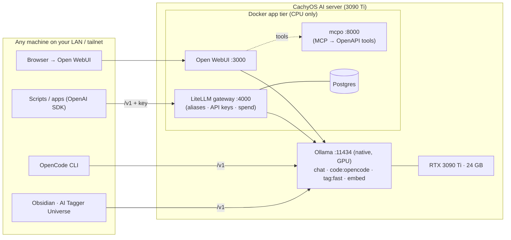

# Local AI Stack — CachyOS (3090 Ti) → your whole network

> **⚠ ai-01 REBUILD (2026-07-15): the model server is now llama-swap +
> llama.cpp (`docker/llama-swap-config.yaml`), NOT native Ollama.** Ollama
> remains only as a 3-model compat shim on :11434 for HA Assist + Obsidian
> (llama3.2:3b, tag:fast, nomic-embed-text) — do not pull big models into it.
> LiteLLM (:4000) stays the authenticated front door; public aliases:
> `coder` (qwen3.6-35b-a3b, bake-off winner) · `coder-strong` (qwen3.6-27b) ·
> `chat` · `chat-creative` · `fast` · `utility` · `embed` (Qwen3-Embedding).
> GPU yields to gaming via llama-swap ttl idle-unload + the Apollo
> session-start hook (`scripts/gpu-yield-unload.sh`, 182 ms measured).
> Model files: `/opt/llm/models` (outside /home — restic must not back up
> weights). Ops agent + read-only fleet tools: `ops/`. Bake-off harness +
> results: `bakeoff/`. Full shipped design + how-to-use:
> **https://wiki.tabaska.us/architecture/local-ai-build/** and
> `HANDOFF-ai-01.md`. Sections below describing native-Ollama tuning
> (01-ollama-tune.sh, 03-model-variants.sh, :11434 clients) are KEPT for the
> shim's sake but describe the LEGACY path.

A network-wide, self-hosted AI backend built on your existing Ollama install. One box serves
models and tools; every other machine (chat UI, coding CLI, Obsidian, scripts) points at it.

**Your hardware:** i7-12700K · 64 GB RAM · RTX 3090 Ti (24 GB) · 5 TB NVMe · CachyOS
**Your goal:** call your models + tools from any machine, for Open WebUI, OpenCode, Obsidian
AI Tagger Universe, and arbitrary tools — with the model lineup free to change over time.

> **Just want the step-by-step?** Follow **[`INSTRUCTIONS.md`](INSTRUCTIONS.md)** — rig setup +
> connecting from the MacBook, top to bottom. This README is the reference/reasoning behind it.

---

## TL;DR — what this sets up

- **Ollama stays native** on the host (keeps direct GPU access + your existing tuning), but now
  listens on the LAN and is tuned for a single 24 GB card.
- A small **Docker "app tier"** runs alongside it: **LiteLLM** (gateway), **Open WebUI** (chat),
  **mcpo** (tool bridge), **Postgres** (for LiteLLM keys).
- **LiteLLM is the key addition** — a single, authenticated, OpenAI-compatible URL with stable
  *model aliases*. Swap `gemma4` → `gemma5` underneath and nothing downstream changes. This is
  the piece that makes "the lineup will change over time" a non-event.
- Everything is reachable at `http://<server>:port`; add **Tailscale** to reach it from anywhere
  with no open ports.

> **Agentic layer (added on):** for the OpenCode + Open WebUI *agents / skills / tools* setup that
> gets close to Claude — model selection for 24 GB, Serena/Context7, subagents, skills, and the
> chat-side parity features — see **[`agentic/README.md`](agentic/README.md)**.

---

## Architecture



Two front doors on purpose:
- **Direct to Ollama (`:11434/v1`)** — simplest; best for OpenCode (isolates tool-calling to the
  model itself) and Obsidian.
- **Through LiteLLM (`:4000/v1`)** — for anything that benefits from a stable alias, an API key,
  or that you might later point at a cloud model. Open WebUI uses Ollama directly *and* can add
  LiteLLM as a second connection.

---

## Part 1 — The toolstack

| Layer | Tool | Runs as | Port | Why it's here |
|---|---|---|---|---|
| Inference | **Ollama** | native systemd | 11434 | You already run it; native = direct GPU + your tuning. |
| **Gateway** | **LiteLLM** | Docker | 4000 | One OpenAI-compatible URL, stable model aliases, per-tool API keys, spend/rate limits, future cloud models. The future-proofing layer. |
| Chat UI | **Open WebUI** | Docker | 3000 | Best-in-class Ollama frontend: multi-model chat, RAG, web search, tools, users. |
| Tool bridge | **mcpo** | Docker | 8000 | Turns stdio MCP servers into OpenAPI so Open WebUI (and any HTTP client) can call them. Central place to host tools. |
| Key store | **Postgres** | Docker | (internal) | Backs LiteLLM virtual keys + spend. |
| Access | **Tailscale** *(opt.)* | native | — | Reach plain-HTTP ports from outside the house, no port-forwarding. |
| TLS/naming | **Your reverse proxy** *(opt.)* | separate host | 443 | Front rig services with friendly `https://` URLs — not on the rig. |

**Models** (managed once on the server, via `03-model-variants.sh`):

| Handle | Built from | For | Notes |
|---|---|---|---|
| `chat` (gemma4:31b-it-qat) | your existing | general chat | ~18 GB |
| `chat-creative` (deckard-heretic) | your existing | creative/uncensored | ~21 GB |
| `code:opencode` | qwen3-coder:30b | OpenCode | **64k ctx**, temp 0.1 for tool reliability |
| `tag:fast` | llama3.2:3b | Obsidian tagging, titles | 8k ctx, temp 0, tiny — coexists with a big model |
| `nomic-embed-text` | pulled | RAG, semantic search | embeddings |

---

## Part 2 — The plan (decisions & constraints)

**Addressing.** Give the server a **DHCP reservation** on your router so its IP never changes, and
use its **mDNS name** (`<hostname>.local`, works out of the box with systemd-resolved/avahi) in all
client configs. Then a laptop uses `http://cachybox.local:11434/v1` regardless of DHCP churn.

**Security.** Ollama's API has **no authentication** and exposes management endpoints (including
*delete model*). So:
1. Firewall the AI ports to your **LAN subnet only** (`02-firewall.sh`). Never port-forward them.
2. Put **LiteLLM in front** for anything that should require a key; mint a separate virtual key per
   tool/person so you can revoke one without touching the rest.
3. For off-LAN access, use **Tailscale** — encrypted, no exposed ports.

**The 24 GB VRAM reality.** Two 18 GB models **cannot** be resident at once. The config sets
`OLLAMA_MAX_LOADED_MODELS=2` so a *small* helper (`tag:fast`, ~3 GB) can sit alongside *one* big
model; requesting a second big model **evicts** the first (a few seconds to reload from your fast
NVMe). `OLLAMA_NUM_PARALLEL=1` keeps KV-cache small. This is the right trade for a mostly-single-user
homelab; raise the numbers only if you add headroom.

**Context length.** OpenCode needs **≥64k context**. Rather than a global setting that wastes VRAM on
every model, context is **baked per model**: `code:opencode` is 64k, `tag:fast` is 8k, chat stays
default. Watch out: 18 GB weights + 64k KV is *tight* on 24 GB even with flash-attention + q8 KV.
After first use, run `ollama ps` — if it shows any CPU/RAM offload, rebuild `code:opencode` with
`num_ctx 49152` or `32768` (edit `03-model-variants.sh`). You already know this dance.

**Tool-calling reliability.** Qwen3-Coder's malformed-tool-call issue is model-side, not transport.
Mitigations baked in: low temperature on the coding variant, and a `"tools": true/false` flag
**per model** in the OpenCode config so you can disable tools on a model that misbehaves. Keep
Devstral 24B as the fallback (commented in the model + LiteLLM configs).

---

## Part 3 — Implementation

Everything is scripted. Get the folder onto the CachyOS box, then:

```bash
cd local-ai-stack
chmod +x scripts/*.sh

# 0) Sanity check — makes no changes, prints your server IP/hostname
./scripts/00-preflight.sh

# If Docker isn't installed yet (CachyOS):
#   sudo pacman -S docker docker-compose
#   sudo systemctl enable --now docker
#   sudo usermod -aG docker $USER   # then log out/in

# 1) Expose + tune Ollama (writes a systemd drop-in, restarts the service)
./scripts/01-ollama-tune.sh

# 2) Firewall to your LAN  — EDIT LAN_SUBNET at the top of the file first!
$EDITOR scripts/02-firewall.sh
./scripts/02-firewall.sh

# 3) Build the purpose-tuned models (pulls a few GB)
./scripts/03-model-variants.sh

# 4) Configure + launch the Docker app tier
cp docker/.env.example docker/.env
#   generate 4 secrets and paste them in:
for i in 1 2 3 4; do openssl rand -hex 32; done
$EDITOR docker/.env
cd docker && docker compose up -d && cd ..

# 5) Verify
AI_HOST=cachybox.local ./scripts/healthcheck.sh
```

Or run `./scripts/bootstrap.sh` to chain steps 0–4 with prompts.

**First-run setup in the UIs:**
- **Open WebUI** (`http://<server>:3000`): the *first account you create becomes admin*. Do it
  immediately. Your Ollama models appear automatically in the model picker.
- **LiteLLM UI** (`http://<server>:4000/ui`): log in as `admin` with your `LITELLM_MASTER_KEY`.
  Mint a virtual key per client under *Virtual Keys* (scope it to specific model aliases if you like).

---

## Client setup (any machine)

**OpenCode** — copy `clients/opencode.json` to `~/.config/opencode/opencode.json`, change
`cachybox.local` to your server. Then `opencode`, `/models`, pick `code:opencode`. (First request
after an idle period reloads the model — normal.)

**Obsidian · AI Tagger Universe** — install from Community Plugins →
*Settings → AI Tagger Universe → LLM Settings*:
- Provider: **Local LLM (Ollama)**
- Endpoint: `http://cachybox.local:11434/v1`
- Model: `tag:fast`
- Temperature: `0`, tag format: **YAML Frontmatter**, then *Test connection*.
- (Bonus: **Smart Connections** for semantic search — point its embedding model at
  `nomic-embed-text` on the same endpoint.)

**Any script / app** — it's just the OpenAI SDK:
```python
from openai import OpenAI
client = OpenAI(base_url="http://cachybox.local:4000/v1",  # LiteLLM
                api_key="sk-your-virtual-key")
print(client.chat.completions.create(
    model="chat",                                          # a LiteLLM alias
    messages=[{"role":"user","content":"hello"}]).choices[0].message.content)
```

**Hosting tools centrally** — add MCP servers to `docker/mcpo-config.json`, `docker compose
restart mcpo`, then in Open WebUI: *Admin → Settings → External Tools → +* → Type **OpenAPI**,
URL `http://mcpo:8000/<toolname>`. (Open WebUI ≥0.6.31 can also add native **MCP/Streamable-HTTP**
servers directly — use that for HTTP MCPs like Context7; use mcpo for stdio ones.)

---

## Add-on: HTTPS (reverse proxy on a separate host)

Open WebUI only needs HTTPS for browser secure-context features (mic input, clipboard, PWA install);
the APIs are already encrypted by WireGuard over Tailscale, so HTTPS is optional. **Do not run Caddy
on the rig** — terminate TLS on an always-on box (Mac mini, NAS, etc.) that reverse-proxies to the
rig's LAN ports.

### Recommended — front all rig services from your existing Caddy

```caddy
# Set RIG_IP to the rig's LAN address in your proxy's .env
ai.{$DOMAIN}      { reverse_proxy {$RIG_IP}:3000 }    # Open WebUI
llm.{$DOMAIN}     { reverse_proxy {$RIG_IP}:4000 }    # LiteLLM
ollama.{$DOMAIN}  { reverse_proxy {$RIG_IP}:11434 }   # Ollama API
mcpo.{$DOMAIN}    { reverse_proxy {$RIG_IP}:8000 }    # mcpo tools
```

Set the advertised URL in `docker/.env` so Open WebUI login redirects work:

```
WEBUI_URL=https://ai.example.com
```

### Plain HTTP over Tailscale (no HTTPS)

`http://<rig>:3000` from any tailnet device is encrypted on the wire. You only lose browser
secure-context features (mic, clipboard, PWA). No `WEBUI_URL` needed.

### Deprecated — bundled Caddy on the rig

An older opt-in tailnet Caddy lived in this repo (`docker compose --profile caddy`). It has been
removed from the default stack. See `docker/Caddyfile.deprecated` if you need that config.

---

## Part 4 — What you might be missing

1. **A gateway (LiteLLM) — the biggest gap.** Without it, every tool hardcodes a model name and a
   raw, unauthenticated Ollama URL. With it you get stable aliases, revocable per-tool keys, spend
   visibility, automatic fallbacks, and a clean path to mixing in cloud models later — all on one
   URL. Highest-leverage addition for your stated goals.
2. **Tailscale handles remote access** — good. Add HTTPS on your always-on reverse proxy if you want
   browser mic/clipboard/PWA features and clean `https://` URLs.
3. **Backups.** Your value is in Open WebUI (chats, users, RAG docs) and LiteLLM (keys, spend) —
   both in Docker named volumes. Snapshot them: `docker run --rm -v open_webui_data:/d -v
   $PWD:/b alpine tar czf /b/openwebui-$(date +%F).tgz -C /d .` (repeat for `litellm_pgdata`).
   Model weights re-pull, so they don't need backup.
4. **Auto-start ordering.** Ollama is a systemd service; the Docker stack uses
   `restart: unless-stopped`, so both survive reboots. If the app tier ever races ahead of Ollama
   on boot, the containers just retry — fine in practice.
5. **Observability.** `healthcheck.sh` + `ollama ps` + `nvidia-smi` cover 95%. If you want graphs,
   LiteLLM exposes Prometheus metrics and there's an admin dashboard in Open WebUI; add
   `nvtop` (`sudo pacman -S nvtop`) for a live GPU view.
6. **Keep OpenCode fully local.** By default it calls a *hosted* small model for session titles.
   The provided config sets `small_model` to a local one so nothing leaves your box.
7. **TLS / friendly names (optional).** Front the rig from your existing reverse proxy — see the
   HTTPS add-on above. Do not run a second Caddy on the rig.
8. **A "golden" second coding model.** You've been bitten by tool-call bugs; having Devstral 24B
   pre-pulled and wired as a LiteLLM fallback means a flaky model degrades gracefully instead of
   blocking you.

---

## Operations cheat-sheet

```bash
# Update the app tier
cd docker && docker compose pull && docker compose up -d

# See what's loaded on the GPU right now
ollama ps

# Swap the model behind an alias (no client changes needed):
#   edit docker/litellm-config.yaml  →  docker compose restart litellm

# Add a new model everywhere:
ollama pull <model>           # then reference it in litellm-config.yaml / opencode.json

# Logs
docker compose -f docker/docker-compose.yml logs -f litellm open-webui mcpo
journalctl -u ollama -f
```

---

## Handoff note (if you point Claude Code at this)

This folder is self-contained. A Claude Code session running **on the CachyOS box** can execute it:
1. Run `scripts/00-preflight.sh`; install Docker if missing.
2. Ask me for the LAN subnet, then edit `scripts/02-firewall.sh`.
3. Run `01`→`02`→`03`.
4. `cp docker/.env.example docker/.env`, generate secrets with `openssl rand -hex 32`, fill them in.
5. `cd docker && docker compose up -d`, then `scripts/healthcheck.sh`.
The scripts are idempotent; anything requiring a human decision (subnet, secrets, admin account) is
called out above.

> These scripts touch systemd, your firewall, and pull GB-scale models. Skim each before running —
> nothing here should be executed blind, on your box or by an agent.
