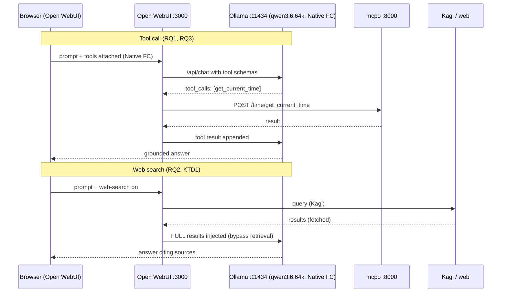

# fix: Repair local-AI-stack tool calling & finish the agentic layer

**Target repo:** `local-ai-tooling` (this document lives in that repo; all repo-relative paths below are relative to its root). Deployed dotfiles that live outside the repo are written as `~/.config/...` — the portable form for this machine (the CachyOS rig, hostname `cachyos`).

---

## Summary

The Docker stack (LiteLLM, Open WebUI, mcpo, Postgres) and native host Ollama are **all running and healthy**. Every bug the user reports is **client-side configuration**, not a broken service. A deep scan confirmed:

- `qwen3.6:64k` tool-calls **correctly** at the model layer (verified via a direct `/api/chat` call with a `tools` payload — it returned a well-formed `tool_calls` response).
- Kagi web search **is returning results** (logs show 142 items fetched and embedded); the model reports "no results" because Open WebUI's embed→retrieve→inject step yields nothing usable.
- mcpo is **healthy and reachable** from the Open WebUI container (HTTP 200), but its tool endpoints were **never registered** in Open WebUI.
- Open WebUI's per-model **Function Calling** is on "Default" (prompt-injection), not "Native".
- The active opencode config has an **empty `opencode.jsonc` stub shadowing the real `opencode.json`**.

This plan fixes the four reported bugs, cleans up config drift, and finishes the agentic layer the repo already designed (expanded mcpo tools, native tool calling across models, a custom Open WebUI model, verified opencode subagents/skills). It closes by baking the fixes into version-controlled config so a rebuild reproduces this state.

**Execution note:** This is an operations/config plan. "Tests" are concrete verification checks (curl probes, chat interactions, `docker`/`ollama` inspections), not unit tests. Each unit's verification is the acceptance gate.

---

## Progress (updated 2026-07-07)

- ✅ **U1** — opencode `.jsonc` stub removed; real config intact (bug R4 fixed).
- ✅ **U2** — mcpo `time`/`fetch`/`context7` registered in Open WebUI (R3 fixed, verified working).
- ✅ **U3** — Native Function Calling on `qwen3.6:64k` (+ tools attached); R1 fixed, verified working.
- ✅ **U4** — Web search Bypass Embedding & Retrieval enabled; R2 fixed, verified working.
- ✅ **U5** — Drift removed: orphaned `~/docker/openwebui/` compose + `openwebui_default` network deleted. (Downloads compose files were unrelated projects — left alone.)
- ✅ **U9** — Fixes baked into `docker/docker-compose.yml` (`ENABLE_WEB_SEARCH`, `WEB_SEARCH_*`, `KAGI_SEARCH_API_KEY`, `BYPASS_EMBEDDING_AND_RETRIEVAL`), `.env`/`.env.example`, `INSTRUCTIONS.md` §8, `agentic/openwebui/SETUP.md`; working volumes snapshotted to `backups/`.
- ⏳ **U6** — Expand mcpo (serena + sequential-thinking + `/repos` mount) — **remaining**.
- ⏳ **U7** — Custom Open WebUI model (assistant bundle) — **remaining** (UI task).
- ⏳ **U8** — Verify opencode plan→build→skills→MCP loop end-to-end — **remaining**.

**All four reported bugs are fixed and confirmed working.** Remaining work (U6–U8) is the optional agentic-layer finish.

---

## Problem Frame

The user runs a self-hosted AI stack (per `README.md` / `INSTRUCTIONS.md` / `agentic/README.md`) intended to serve models and tools network-wide and get OpenCode + Open WebUI "close to Claude." The base stack was brought up successfully, but the agentic/tooling layer was never fully wired, leaving four visible failures and several drift artifacts. The user asked for a deep scan and a plan to reconcile reality with the original design and eliminate the bugs.

### Verified current state (scan results)

| Component | State | Evidence |
|---|---|---|
| Ollama (host, native) | Healthy, tuned, LAN-exposed | `*:11434`; systemd override sets `OLLAMA_HOST=0.0.0.0`, `FLASH_ATTENTION=1`, `KV_CACHE_TYPE=q8_0`, `MAX_LOADED_MODELS=2`, `NUM_PARALLEL=1` |
| LiteLLM `:4000` | Healthy, 5 aliases | `/v1/models` → chat, chat-creative, code, utility, embed; `/health` OK |
| Open WebUI `:3000` | Healthy | reaches host Ollama; reaches `mcpo:8000` (HTTP 200) |
| mcpo `:8000` | Healthy | `/docs` 200; `time`, `fetch`, `context7` all serving OpenAPI |
| Postgres | Healthy | LiteLLM keys/spend backing store |
| `qwen3.6:64k` tool calling | **Model OK** | direct `/api/chat` returned `tool_calls:[get_weather(city=Paris)]` |
| OWUI tool servers | **MISSING** | DB `config.tool_server` absent |
| OWUI web search | **Broken injection** | engine=kagi, results fetched + 142 items embedded, `bypass_embedding_and_retrieval:false` → nothing reaches model |
| opencode config | **Conflict** | empty `~/.config/opencode/opencode.jsonc` beside real `opencode.json` |

---

## Root-Cause Analysis (traces to the four reported bugs)

- **R1 — "qwen3.6:64k has no tool calling."** False at the model layer. In Open WebUI the model's *Advanced Params → Function Calling* is "Default" (unreliable prompt-injection, especially with a thinking model) and **no tools are attached**, so the model never receives tool schemas natively. Fix = register tools (R3) + set Function Calling = **Native** per tool-capable model.
- **R2 — "web search returns no results despite results in thinking."** Kagi returns; OWUI embeds 142 snippets into a `web-search-*` collection, then RAG-retrieves top-k. Retrieval returns nothing usable to the model, so it reports "no results." Fix = enable **Bypass Embedding and Retrieval** (full-context mode) — the search text is injected directly into the model's 64k window. (Ollama-embedding + Hybrid Search deferred as a follow-up for heavy document RAG.)
- **R3 — "no tools in Open WebUI."** mcpo endpoints were never registered under Admin → External Tools (`config.tool_server` missing). mcpo is healthy and reachable from the container. Fix = register `/time`, `/fetch`, `/context7` (and `/serena`, `/sequential-thinking` after U6).
- **R4 — "no tools in opencode."** An empty `~/.config/opencode/opencode.jsonc` (`{ "$schema": ... }`, 50 bytes, older) sits next to the real `~/.config/opencode/opencode.json` (full config: Ollama provider, model, serena + context7 MCP, skills). The stub can shadow the real config, yielding no provider/model/MCP/tools. `uvx` and `npx` are present, so MCP servers will start once the conflict is removed.

---

## Requirements

- **RQ1** — In Open WebUI, a tool-capable model (`qwen3.6:64k`/`qwen3.6:27b`) reliably issues native tool calls and receives tool results. *(traces R1)*
- **RQ2** — Web search in Open WebUI produces answers grounded in the actual search results, with citations. *(traces R2)*
- **RQ3** — mcpo tools appear and are callable in Open WebUI. *(traces R3)*
- **RQ4** — opencode loads its full config: Ollama models, serena + context7 MCP tools, and skills. *(traces R4)*
- **RQ5** — Config drift removed; a single, version-controlled source of truth per component; a rebuild reproduces the working state.
- **RQ6** — The agentic layer is finished to the repo's own design: expanded mcpo tool host, native tool calling across tool-capable models, ≥1 custom Open WebUI model, verified opencode subagent/skill workflow.

---

## Key Technical Decisions

- **KTD1 — Web search fix = Bypass Embedding & Retrieval (full-context), not RAG retrieval.** The reported symptom is retrieval returning nothing despite successful fetch+embed. Full-context injection sidesteps the failing retrieval class entirely and fits comfortably in the 64k window. The repo's documented Ollama-embedding + Hybrid Search path (`agentic/openwebui/SETUP.md` §3) is deferred to follow-up for large-document knowledge bases. *(user-selected)*
- **KTD2 — Prefer env-as-code in `docker/docker-compose.yml` for OWUI settings that env can own; use the Admin UI only for per-model params and tool registration that env cannot express cleanly.** Serves the repo's "config is code" ethos and reproducibility (RQ5). **Gotcha:** Open WebUI uses `PersistentConfig` — once a value exists in the DB, env changes are ignored on later boots. Decision in U9: set the target values through the UI (authoritative for already-persisted keys like `web.search.engine`) **and** record them in compose env + docs so a fresh volume reproduces them. Do **not** blanket-set `ENABLE_PERSISTENT_CONFIG=false` (it would strip the ability to change anything from the UI).
- **KTD3 — Native Function Calling only on verified tool-capable models.** `qwen3.6:64k`, `qwen3.6:27b`, `qwen3.6:35b-a3b`, `devstral:24b`, `code:opencode` get Native; weak tool-callers (`gemma4*`, `tag:fast`) stay on Default per `agentic/openwebui/SETUP.md` §1.
- **KTD4 — Remove the opencode `.jsonc` stub rather than editing it.** The real config is `opencode.json`; deleting the empty `.jsonc` removes ambiguity with zero risk (it holds only `$schema`). *(traces R4)*
- **KTD5 — Serena in mcpo is opt-in and repo-scoped.** The expanded `agentic/docker/mcpo-config.json` points serena at `/repos/simpler-grants-gov`; serena in the mcpo container only sees mounted paths. Mount a `/repos` volume (U6) or drop serena from the chat-side tool host. Sequential-thinking and context7 need no mounts.

---

## High-Level Technical Design

Target request flows once fixed (Open WebUI native tool call + web search over the same stack):

Component status is authoritative in prose above; this diagram shows the two target flows, not implementation specifics.

---

## Implementation Units

Grouped into four phases: **A. Unblock the four bugs** (U1–U4) · **B. Hygiene** (U5) · **C. Finish agentic layer** (U6–U8) · **D. Reproducibility** (U9). Phase A units are independent of each other and can land in any order.

### U1. Remove opencode config conflict; verify MCP + skills load

**Goal:** opencode unambiguously loads its full config so MCP tools and skills appear. *(RQ4, R4)*
**Dependencies:** none.
**Files:**
- `~/.config/opencode/opencode.jsonc` — **delete** (empty stub).
- `~/.config/opencode/opencode.json` — canonical; no change (source of truth: `agentic/opencode/opencode.json`).
**Approach:** Delete the stub. Confirm opencode reads `opencode.json`. Confirm serena (`uvx --from git+…serena`) and context7 (remote) MCP servers start, and `skills*` are available. `uvx`/`npx` confirmed present.
**Patterns to follow:** `agentic/opencode/opencode.json` (the installed template).
**Test scenarios:**
- Launch `opencode` in a real git repo; `/models` lists `ollama/qwen3.6:27b` (default) and the other Ollama entries.
- In-session, MCP tools from serena and context7 are listed/available (e.g., serena symbol tools; `context7` reachable).
- A skill from `~/.config/opencode/skills/` triggers on an appropriate prompt.
- Negative: with the `.jsonc` restored, tools disappear (confirms the stub was the shadow) — then delete again.
**Verification:** opencode shows the Ollama models + MCP tools + skills in a fresh session.

### U2. Register mcpo tool servers in Open WebUI

**Goal:** mcpo tools are visible and callable in Open WebUI. *(RQ3, R3)*
**Dependencies:** none (U6 adds more endpoints later).
**Files:** `docker/docker-compose.yml` — add `TOOL_SERVER_CONNECTIONS` env to `open-webui` (JSON array of OpenAPI connections) **or** register via Admin UI (see KTD2).
**Approach:** Add each mcpo subpath as an **OpenAPI** tool server pointing at the container-internal URL `http://mcpo:8000/<name>` (`time`, `fetch`, `context7`). Same-network reachability already verified (HTTP 200). Attach tools to a model or enable per-chat.
**Patterns to follow:** `agentic/openwebui/SETUP.md` §2.
**Test scenarios:**
- Admin → Settings → External Tools lists `time`, `fetch`, `context7` as connected (green).
- In a chat with tools enabled, the model calls `get_current_time` and returns the correct local time.
- `fetch` retrieves a URL's content on request.
- Failure path: stop mcpo (`docker stop mcpo`) → OWUI shows the tool server as unreachable rather than silently succeeding; restart after.
**Verification:** at least one mcpo tool executes end-to-end from a chat.

### U3. Enable Native Function Calling on tool-capable models

**Goal:** `qwen3.6:64k` (and peers) issue reliable native tool calls in Open WebUI. *(RQ1, R1)*
**Dependencies:** U2 (tools must exist to be called).
**Files:** none in repo (per-model DB setting); record the model list in `agentic/openwebui/SETUP.md`.
**Approach:** Admin → Settings → Models → for each model in KTD3: Advanced Params → **Function Calling = Native**. Leave weak tool-callers on Default.
**Test scenarios:**
- With `qwen3.6:64k` + tools attached, "what time is it in New York?" triggers a native `time` tool call and a grounded answer (this is the exact previously-failing case).
- `qwen3.6:27b` behaves the same.
- Control: a Default-mode model still works for plain chat (no regression).
- Covers R1: the model that "had no tool calling" now calls a tool from the UI.
**Verification:** `qwen3.6:64k` completes a tool-using turn in Open WebUI.

### U4. Fix web search — enable Bypass Embedding & Retrieval

**Goal:** web search answers are grounded in the actual results. *(RQ2, R2, KTD1)*
**Dependencies:** none.
**Files:** `docker/docker-compose.yml` — add `BYPASS_EMBEDDING_AND_RETRIEVAL=true` (and keep `ENABLE_RAG_WEB_SEARCH=true`, `RAG_WEB_SEARCH_ENGINE=kagi`) for reproducibility; also toggle in Admin → Settings → Web Search (authoritative per KTD2).
**Approach:** Turn on "Bypass Embedding and Retrieval" so fetched search text is injected directly into context instead of RAG-chunked. Optionally raise `concurrent_requests` from `0` to a small value (e.g. 5) for parallel page fetches.
**Test scenarios:**
- Web-search a current-events query with `qwen3.6:64k`; the answer reflects the returned pages and shows citations (previously returned "no results").
- Confirm in `open-webui` logs that results are fetched **and** the model output references them (no more embed→retrieve gap).
- Edge: a query with sparse results still answers gracefully rather than falsely claiming none.
- Covers R2.
**Verification:** a web-search chat returns a sourced answer.

### U5. Remove config drift / hygiene cleanup

**Goal:** one source of truth per component; no stray/competing configs. *(RQ5)*
**Dependencies:** none.
**Files:**
- `~/docker/openwebui/docker-compose.yaml` — **remove** (orphaned second Open WebUI compose; its `open-webui` name/port would collide with the live stack).
- Orphaned Docker network `openwebui_default` — `docker network rm openwebui_default` (currently no attached containers).
- `~/Downloads/docker-compose.yml`, `~/Downloads/docker-compose(1).yml` — **remove** (stale downloads) after a glance to confirm they are not a newer intended variant.
- `README.md` — add a one-line "single source of truth: `docker/` in this repo" note if not already clear.
**Approach:** Confirm nothing references the orphaned compose/volume, then delete. The live stack is the `docker` compose project from `docker/docker-compose.yml` (verified via `docker compose ls`).
**Test scenarios:**
- `docker compose ls` shows only the `local-ai-tooling/docker` project.
- `docker network ls` no longer lists `openwebui_default`.
- Re-running `docker compose -f docker/docker-compose.yml up -d` is a clean no-op (stack already current).
- Test expectation: no behavioral change to the running stack — pure cleanup.
**Verification:** only the intended compose project and networks remain; live stack unaffected.

### U6. Expand the mcpo tool host (serena + sequential-thinking)

**Goal:** the chat-side tool host matches the repo's agentic design. *(RQ6, KTD5)*
**Dependencies:** U2 (base registration mechanism).
**Files:**
- `docker/mcpo-config.json` — replace with the expanded set from `agentic/docker/mcpo-config.json` (adds `sequential-thinking`, `serena`; keeps `time`/`fetch`/`context7`).
- `docker/docker-compose.yml` — add a `/repos` bind mount to the `mcpo` service so serena can reach a project (KTD5); decide the serena `--project` path (default `/repos/simpler-grants-gov`).
**Approach:** `docker compose restart mcpo` after config change; confirm new subpaths serve OpenAPI; register `/serena` and `/sequential-thinking` in Open WebUI (extends U2). If no repo is mounted, drop serena from the chat-side config rather than leaving it failing.
**Patterns to follow:** `agentic/docker/mcpo-config.json`; `agentic/openwebui/SETUP.md` §2.
**Test scenarios:**
- `curl :8000/sequential-thinking/openapi.json` and `:8000/serena/openapi.json` return 200 after restart.
- mcpo startup log shows "Successfully connected to: serena, sequential-thinking" (like the current time/fetch/context7 lines).
- In Open WebUI, `sequential-thinking` is callable; serena reaches the mounted repo (a symbol lookup succeeds).
- Failure path: serena with no mounted `/repos` logs a clear connect error — caught before registering.
**Verification:** expanded tools serve and register; serena resolves against a mounted repo (or is intentionally omitted).

### U7. Create a custom Open WebUI model (Claude-Projects analog)

**Goal:** one reusable "assistant" bundling base model + system prompt + tools. *(RQ6)*
**Dependencies:** U2, U3 (tools + native FC).
**Files:** none in repo (OWUI Workspace object); document the recipe in `agentic/openwebui/SETUP.md` §4.
**Approach:** Workspace → Models → +. Base = `qwen3.6:64k` (Native FC), attach `serena` + `fetch` (+ `time`), a review/coding-focused system prompt; optionally attach a knowledge base later.
**Test scenarios:**
- The custom model appears in the chat model picker.
- It auto-has its tools without per-chat toggling and completes a tool-using turn.
- Test expectation: config/UX only — behavior inherits from U2/U3, which carry the tool-calling assertions.
**Verification:** the custom model runs a tool-using conversation out of the box.

### U8. Verify the opencode agentic workflow end-to-end

**Goal:** confirm the plan→build→skills→MCP loop the repo designed actually works. *(RQ6, RQ4)*
**Dependencies:** U1.
**Files:** none (verification unit); note any gaps back into `agentic/opencode/opencode.json` or `agentic/README.md`.
**Approach:** In a real repo, exercise: `plan` agent (read-only) → `build` agent (edits), serena symbol navigation, context7 doc lookup ("use context7"), one custom `/command`, and `small_model` staying local for titles.
**Test scenarios:**
- `plan` agent cannot edit/bash; `build` agent can (permissions from config hold).
- Serena answers a "find definition of X" without grep-dumping the file.
- context7 returns current library docs on demand.
- A `/command` (e.g. commit/test) runs.
- Session titles use the local `small_model` (nothing leaves the box).
- Covers RQ4 at the workflow level (beyond U1's load check).
**Verification:** a full plan→build cycle with MCP + skills completes locally.

### U9. Bake fixes into version-controlled config + docs; note follow-ups

**Goal:** a rebuild reproduces this working state; the persistent-config gotcha is documented. *(RQ5)*
**Dependencies:** U2–U7.
**Files:**
- `docker/docker-compose.yml` — finalize OWUI env (`BYPASS_EMBEDDING_AND_RETRIEVAL`, web-search env, `TOOL_SERVER_CONNECTIONS` if used, mcpo `/repos` mount).
- `docker/.env.example` — mirror any new env keys.
- `agentic/openwebui/SETUP.md` — record exact settings: Native FC model list, bypass-retrieval, tool registration, custom-model recipe.
- `INSTRUCTIONS.md` — add a short "post-bootstrap OWUI settings" checklist.
- `README.md` — note the `PersistentConfig` gotcha (KTD2) and the deferred Ollama-embedding + Hybrid Search RAG path.
**Approach:** Reconcile UI-set values with env; document which are DB-authoritative. Keep a backup per `README.md` "Backups" (snapshot `open_webui_data`, `litellm_pgdata`).
**Test scenarios:**
- `git diff` shows the config/doc changes; repo is the single source of truth.
- Dry-run mental rebuild: a fresh `open_webui_data` volume + these env vars yields tools + web search working without re-clicking (for env-ownable settings).
- Test expectation: docs/config only — no runtime behavior change beyond persistence.
**Verification:** committed config + docs describe and reproduce the fixed state.

---

## Scope Boundaries

**In scope:** the four bug fixes (R1–R4), config-drift cleanup, and finishing the agentic layer to the repo's own design (expanded mcpo tools, native tool calling, one custom OWUI model, verified opencode workflow), plus reproducibility docs.

### Deferred to Follow-Up Work
- **Ollama-embedding + Hybrid Search RAG** (`RAG_EMBEDDING_ENGINE=ollama`, `nomic-embed-text`, `ENABLE_RAG_HYBRID_SEARCH`, reranker) for large document knowledge bases — the alternative to KTD1, worthwhile once heavy document RAG is needed.
- **LiteLLM `code-fallback` (Devstral) auto-fallback** — uncomment in `docker/litellm-config.yaml` + `router_settings.fallbacks` if a coding model degrades.
- **HTTPS front door** via the separate reverse proxy (`WEBUI_URL` already set to `https://ai.tabaska.us`) — only needed for browser mic/clipboard/PWA.
- **Off-rig client setup** (MacBook opencode pointing at the rig over Tailscale) — `INSTRUCTIONS.md` Phase 2 already covers it.
- **Obsidian AI Tagger / Smart Connections** wiring to `tag:fast` / `nomic-embed-text`.

### Out of scope
- Model retraining/quantization changes; VRAM re-tuning (current Ollama tuning verified correct).
- Adding cloud models to LiteLLM.

---

## Risks & Dependencies

- **PersistentConfig overrides env (KTD2).** Changing compose env won't move already-persisted OWUI settings. Mitigation: set via UI now, record env for fresh-volume rebuilds, document the gotcha (U9).
- **Serena in mcpo needs a mounted repo (KTD5).** Without `/repos`, serena fails to connect. Mitigation: mount `/repos` or omit serena chat-side (U6).
- **Thinking-model + tools quirks.** If Native FC on `qwen3.6:64k` still misbehaves under load, fall back to `qwen3.6:27b`/`devstral:24b` per KTD3 (models already present).
- **VRAM pressure at 64k.** After real use, `ollama ps`; if CPU offload appears, switch to `qwen3.6:35b-a3b` or lower `num_ctx` per `README.md` "Context length."
- **Backups before churn.** Snapshot `open_webui_data` before bulk settings changes (U5/U9) so a mistake is recoverable.

---

## Sources & Research (in-repo, authoritative)

- `README.md` — base stack architecture, security, VRAM/context reasoning, ops cheat-sheet.
- `INSTRUCTIONS.md` — rig + client setup order.
- `agentic/README.md` — agentic layer design (model×harness, subagents, skills, MCP).
- `agentic/openwebui/SETUP.md` — §1 Native tool calling, §2 tools/mcpo, §3 RAG/embedding, §4 custom models.
- `docker/docker-compose.yml`, `docker/litellm-config.yaml`, `docker/mcpo-config.json`, `agentic/docker/mcpo-config.json`, `agentic/opencode/opencode.json` — the configs being reconciled.
- Live scan (2026-07-07): `docker ps/compose ls`, `ollama show/ps`, direct `/api/chat` tool test, mcpo `/docs`, LiteLLM `/v1/models`+`/health`, OWUI DB `config` dump, OWUI logs.
